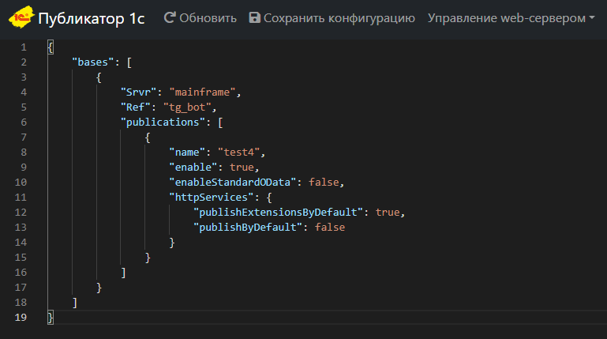

# Публикатор баз 1с

Это механизм удобной и быстрой публикации баз 1с на веб-сервере.

## Зачем все это?

Повысить удобство управления публикацями баз 1с, дать возможность публиковать базы разработчиков в тестовом контуре без доступа на сервер.

## Установка

На данный момент возможно 2 способа испоьзования продукта:

1. Docker-контейнер.
    
    Из-за лицензионной политики 1с, не получается собрать уже готовые образы и выложить их в хаб, потому для начала работы необходимо собрать image.
    Для этого выполните несколько действий:

    * Переименуйте [.onec.env.example](/.onec.env.example) в onec.env
    * Заполните необходимые параметры
    * Запустите скрипт [build-publicator.sh](/build-publikator.sh)
    * Если вдруг, автоматически скачать релиз с сайта 1с не получается, то его можно положить в каталог [/webserver/distr](/webserver/distr/)

    После сборки необходимо заполнить параметры вашего приложения:

    * Переименовать [config.json.example](/volumes/config.json.example)
    * Описать в конфиге публикацию вашей базы. (можно сделать позже. после запуска)
    * прописать в [docker-compose.yaml](/docker-compose.yaml) image созданый на этапе сборки

    Все! можно запускать приложение:

    `docker-compose up -d`

2. Взять приложение из списка релизов.
    * Скачать архив
    * Распаковать
    * Внести в файл `autumn-properties.json` изменения, указав путь к вашему апач, и путь к 1с и к каталогу публикаций. И запустить `oscript main.os`

## Использование

Для удобства использования реализован веб интерфейс, доступный по порту :3333

### Графический интерфейс

Реализован графичекий интерфейс. Я постарался его сделать адаптивным и приятно выглядищим на всех видах устройств.

### Редактирование карточки публикации

* Реализована графическая настройка и валидация таких групп параметров как http-сервисы, web-сервисы, общие настройки и oidc

### Настройка OpenId Connect

Реализован, и будет дополняться графический интерфейс для реализации oidc подключений к базе.

## To-do
Что будет дорабатываться:

* Добавить схему json для подсказок и валидации

## Спасибо

* Разработчикам фреймворка autumn! C желудями жизнь становится сильно проще и красочнее
* Разработчикам веб-сервера [winow](https://github.com/autumn-library/winow)